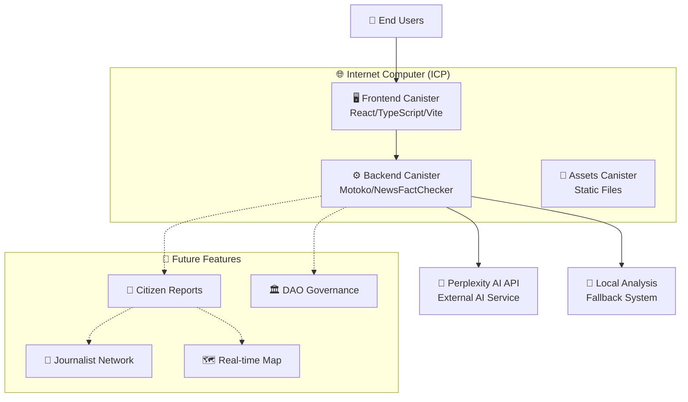

# 🗳️ Veritas: Decentralized Electoral News Verifier with AI on Internet Computer

## 🏆 AI Track - ICP Hackathon Project

**Veritas** is pioneering the future of decentralized AI applications on Internet Computer Protocol (ICP), building transparent and trustless electoral verification systems without middlemen. This project exemplifies how AI can be made decentralized, secure, and scalable on blockchain infrastructure.

## Project Overview

**Veritas** is a **Decentralized Electoral News Verifier** specialized for Ecuador 2025 elections and beyond. Its primary mission is to combat misinformation by enabling users to analyze the veracity of news texts through advanced AI technology. The project provides detailed analysis including concise summaries, confidence levels, consulted sources, verification reasoning, relevant context, information consistency, and reader recommendations.

A key feature of Veritas is its integration with **external AI engines (Perplexity AI)** for deep, contextualized analysis, while maintaining a **robust local fallback mechanism** ensuring basic verification functionality remains available even when external APIs are inaccessible.

## 🌐 Multilingual Intelligence

Veritas features **automatic language detection** and supports both **English and Spanish** analysis:
- 🇺🇸 **English**: Full analysis for international electoral news
- 🇪🇸 **Spanish**: Specialized analysis for Latin American elections
- 🤖 **Smart Detection**: Automatically detects input language and responds accordingly
- 🔄 **Seamless Experience**: No manual language switching required

## 🏗️ Decentralized Architecture

This project is built on **Internet Computer (ICP)**, operating as a **Decentralized Application (dApp)** with clear separation between backend and frontend, embodying the principles of decentralized AI.

### 1. Backend (Canister `project_backend`)

The brain of the news verifier, implemented as a Motoko canister.

* **Technology:** Developed in **Motoko**, ICP's native programming language optimized for canisters.
* **Core Functionality:**
    * **Input Validation:** Manages validation of received news text (max 4000 characters, non-empty).
    * **Perplexity AI Integration:** Performs **HTTP Outcalls** to interact with external Perplexity AI API. Sends carefully structured prompts instructing the AI to act as a news verifier specialized in elections, requesting responses in predefined JSON format.
    * **Multilingual Processing:** Automatic language detection and language-specific prompt generation.
    * **Response Parsing:** Processes and parses JSON responses from Perplexity AI, extracting fields like `resultado`, `confianza`, `resumen`, `fuentes_consultadas`, `evidencia`, `contexto`, `consistencia`, and `recomendaciones`.
    * **Fallback Mechanism:** When Perplexity API calls fail, the canister executes `performLocalAnalysis` function that performs basic verification based on predefined keywords, ensuring preliminary results are always provided.
    * **State Persistence:** Motoko canisters offer default state persistence, maintaining the internal state of the `NewsFactChecker` actor securely on blockchain without external databases.
    * **Utility Functions:** Includes auxiliary functions for string handling (JSON escape/unescape) and type conversion.
    * **Public Functions (`Canister Methods`):**
        * `analyzeNews(newsText)`: Main function to initiate verification process.
        * `greet(name)`: Example function for basic interaction.
        * `getSystemInfo()`: Provides metadata about verifier version, supported languages, max text length, and API provider.
        * `testApiConnection()`: Allows verification of Perplexity API connectivity.

### 2. Frontend (Canister `project_frontend`)

Interactive user interface enabling users to interact with the system.

* **Technology:** Developed as a **Single Page Application (SPA)** using **React** for dynamic UI construction, **Vite** as fast bundler for development and production optimization, and **TypeScript** for robust, scalable development. Styles managed with **SCSS**.
* **Purpose:** Offers intuitive user experience where users can input news text and receive visually appealing, detailed analysis. Interface displays verification status, confidence level, summary, evidence, context, consistency, recommendations, and reference source links.
* **Backend Communication:** Communicates with `project_backend` on ICP using `@dfinity/agent` and `@dfinity/candid` libraries. The `declarations` folder contains Candid interfaces automatically generated by DFX, facilitating this interaction.
* **Deployment:** Web application is compiled and deployed as an *assets canister* on ICP network, meaning the frontend is hosted directly on blockchain, inheriting decentralization and censorship resistance.

### 3. Key Tools and Configurations

* **DFX (`dfx.json`):** Official Internet Computer SDK command-line tool. Manages canister lifecycle (creation, deployment, function calls) and automates Candid interface generation.
* **NPM (`package.json`, `package-lock.json`):** Used for Node.js dependency management in root project and `project_frontend` subproject.
* **Vite (`vite.config.js`):** Vite configuration, optimizing development process and final frontend compilation.

## 🆔 Canister IDs

- **Backend Canister:** `uxrrr-q7777-77774-qaaaq-cai`
- **Frontend Canister:** `u6s2n-gx777-77774-qaaba-cai`
- **Wallet Canister:** `uqqxf-5h777-77774-qaaaa-cai`

## 🚀 Getting Started

### Prerequisites
- Node.js (>=16.0.0)
- DFX (Internet Computer SDK)
- Git

### Installation & Deployment

```bash
# Clone the repository
git clone <repository-url>
cd ICP-veritas

# Install dependencies
npm install

# Start local ICP replica
dfx start --background

# Deploy to local network
dfx deploy

# Access the application
# Frontend will be available at: http://localhost:4943/?canisterId=<frontend-canister-id>
```

### Usage

1. **Access the Web Interface**: Open the frontend URL in your browser
2. **Input News Text**: Paste electoral news in English or Spanish
3. **Automatic Analysis**: The system automatically detects language and analyzes content
4. **Review Results**: Get detailed verification with confidence levels, sources, and recommendations

## 🎯 Roadmap & Future Development

### Phase 1: Enhanced AI Capabilities (Q3 2024) ✅
- [x] Multilingual support (English/Spanish)
- [x] Advanced language detection
- [x] Improved confidence scoring
- [x] Better error handling and fallbacks

### Phase 2: Citizen Reporting Network (Q4 2024) 🚧
- [ ] **📱 Irregularity Reporting System**: Waze-like platform for citizens to report electoral irregularities
- [ ] **🗺️ Real-time Electoral Map**: Interactive map showing reported incidents and verification status
- [ ] **📰 Journalist Alert Network**: Direct notifications to journalists about incidents requiring investigation
- [ ] **📍 Geolocation Integration**: GPS-based incident reporting with location verification
- [ ] **🔔 Push Notifications**: Real-time alerts for urgent electoral incidents

### Phase 3: Advanced Decentralized Features (Q1 2025) 🔮
- [ ] **🏛️ On-chain Governance**: Community voting on verification standards and policies
- [ ] **🎖️ Reputation System**: Blockchain-based credibility scoring for sources and reporters
- [ ] **💰 Token Incentives**: Reward system for quality reporting and accurate verifications
- [ ] **🤝 Cross-platform Integration**: APIs for other electoral monitoring platforms
- [ ] **📊 Analytics Dashboard**: Comprehensive misinformation trend analysis

### Phase 4: Global Expansion (Q2 2025) 🌍
- [ ] **🌎 Multi-country Support**: Expand beyond Ecuador to Latin America
- [ ] **🗣️ Additional Languages**: Portuguese, French, and other regional languages
- [ ] **🤖 AI Model Diversity**: Integration with multiple AI providers for better accuracy
- [ ] **📱 Mobile Applications**: Native iOS and Android apps
- [ ] **🔗 Blockchain Interoperability**: Cross-chain verification and data sharing

### Phase 5: AI Innovation (Q3 2025) 🧠
- [ ] **🔬 On-chain AI Models**: Deploy smaller AI models directly on ICP canisters
- [ ] **🔍 Pattern Recognition**: Advanced detection of coordinated misinformation campaigns
- [ ] **📈 Predictive Analytics**: Early warning systems for potential electoral manipulation
- [ ] **🎭 Deepfake Detection**: Image and video verification capabilities
- [ ] **📱 Browser Extensions**: Real-time verification while browsing social media

## 🎯 Why Veritas Must Scale

### 1. **Democratic Integrity Crisis** 🏛️
Electoral misinformation poses an existential threat to democratic processes worldwide. Veritas provides the infrastructure needed to combat this at scale.

### 2. **Decentralization Advantage** 🌐
Unlike centralized fact-checkers that can be compromised or biased, Veritas operates on trustless blockchain infrastructure, ensuring transparency and resistance to manipulation.

### 3. **Real-time Response Network** ⚡
The planned citizen reporting system will create the world's first decentralized, real-time electoral monitoring network, enabling immediate response to irregularities.

### 4. **Journalistic Empowerment** 📰
By connecting citizens directly with journalists through the platform, Veritas bridges the gap between grassroots observation and professional investigation.

### 5. **Global Democracy Support** 🌍
As the platform scales internationally, it becomes a critical infrastructure for supporting democratic processes in emerging democracies and regions with limited press freedom.

### 6. **AI Innovation on Blockchain** 🤖
Veritas pioneers new models for decentralized AI applications, proving that sophisticated AI can operate efficiently on blockchain infrastructure.

## 🏛️ Architecture Diagram



## 🛠️ Technical Stack

- **Blockchain:** Internet Computer Protocol (ICP)
- **Backend:** Motoko (Native ICP Language)
- **Frontend:** React + TypeScript + Vite
- **Styling:** SCSS with modern responsive design
- **AI Integration:** Perplexity AI API with HTTP Outcalls
- **Development:** DFX SDK, Node.js ecosystem
- **Languages Supported:** English, Spanish (with automatic detection)

## 🤝 Contributing

We welcome contributions from developers, researchers, and democracy advocates! Please see our contributing guidelines and join our mission to build decentralized AI for electoral integrity.

## 📜 License

This project is licensed under the GNU General Public License v3.0 - see the [LICENSE](LICENSE) file for details.

## 🌟 Acknowledgments

- **Internet Computer Protocol** for providing the decentralized infrastructure
- **Perplexity AI** for advanced AI analysis capabilities
- **Open source community** for tools and libraries that make this project possible
- **Democracy advocates worldwide** who inspire our mission

---

**Veritas** - *Truth through Decentralized AI* 🗳️✨

*Building the future of electoral integrity, one verification at a time.*